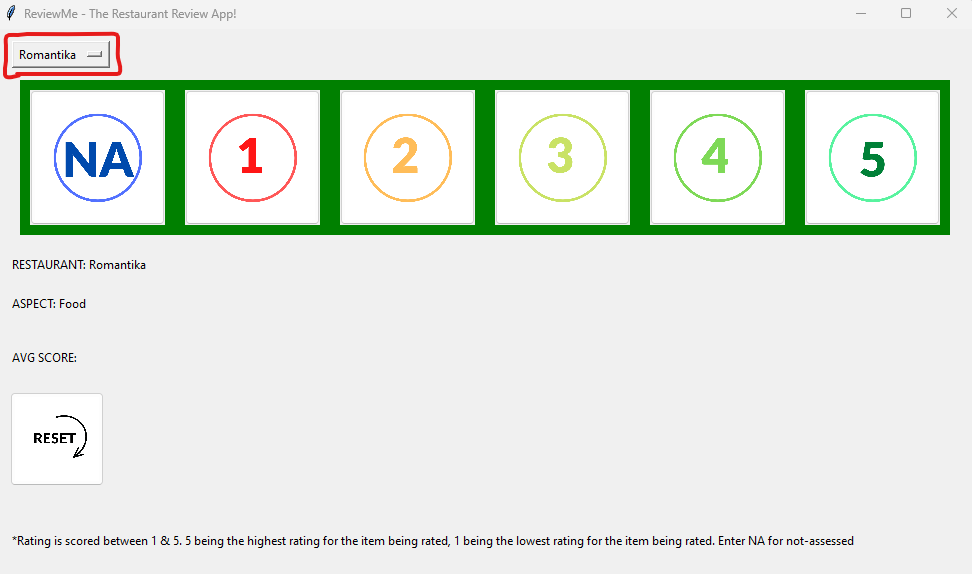
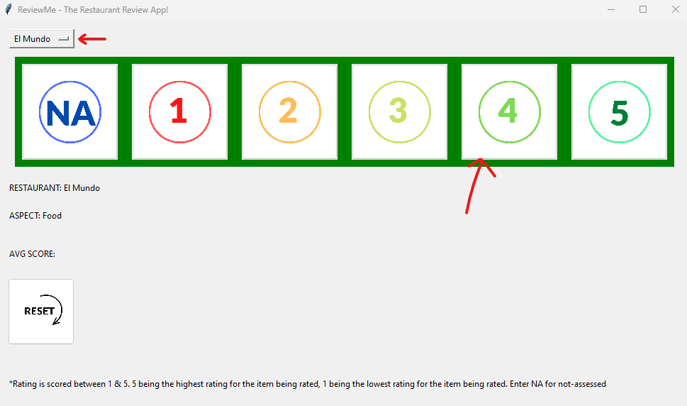
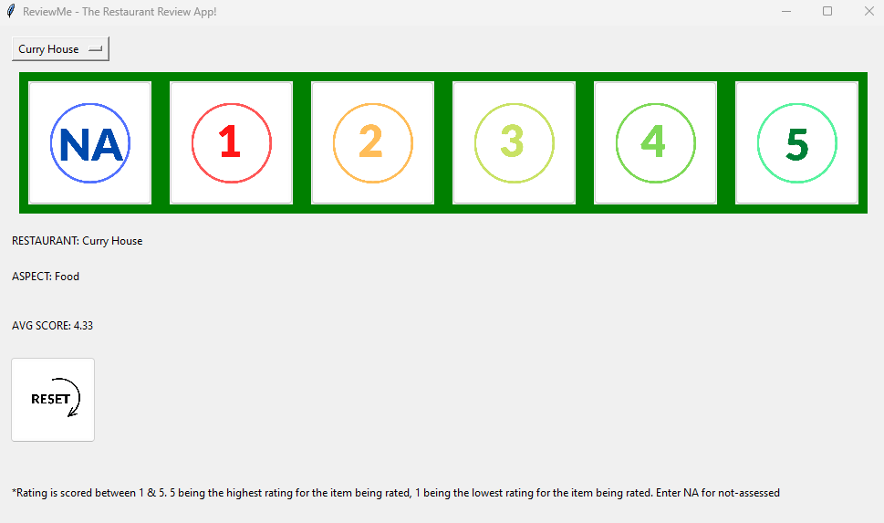

# README - rating.py

rating.py is a GUI program that iss created from the Python tkinter library framework. The program displays a series
of buttons from 1 to 5 that the user clicks to submit a score for a particular aspect (Food, Wine & Atmosphere) 
A button with "NA" is present if the score is not-applicable. 

The ratings data is written to a text file called ratings.txt and is saved in the working the directory. 

This file is also read in the program to calculate a running average for each restaurant and associated aspect being
rated.

The program makes use of: 
<li> tkinter library and GUI elements such as buttons, frames, labels & drop-down menus.
<li> loops
<li> if statements
<li> functions
<li> dictionaries, tuples & lists
<li> loops

## Installation

To install the program, save rating.py into a directory.

## Usage

You need a python3 interpreter to run the program. 
To run it in bash from the same directory where you saved rating.py, use the command 
"python3 rating.py".
Additionally, you will need to download and place the resources package in the working directory. This contains images 
for the buttons

## Program Design
- The program design is set out with GUI elements from tkinter and functions for each part of functionality
- In the top left corner of the screen, a drop-down menu can be used to choose the restaurant to rate. Refer below:
- 
- The screen loads with teh first aspect initiated - FoodScores() method is called. This method acts like a base method and whe nthe reset button is called, will reset back to the FoodScores() frame.
- Once a rating value button is clicked by the user, the aspect then changes to the WineScores() frame. Similarly once a ratings button is clicked, the next and final aspect is called -> AtmoScores().
- Additionally, the reset button can be used to reset the current scores and go back to the initial FoodScores() frame and the current scores will be deleted. This will not add any scores to the ratings.txt file
- Once all 3 aspects have been rated, a popup window will show up thanking the user for the ratings and to confirm to submit the scores or to reset and start again.
- There is also a running average value of the restaurants current rating for a particular aspect at the AVG SCORE label 
- Note: ratings.txt can be deleted and reset, or can have restaurant data in the form of "Romantika, Food:1"
- Each frame FoodScores(), WineScores(), AtmoScores() have been highlighted with a green, red & blue background respectively to help note the change in aspect to be rated.
## Example interactions

Example interactions with the program could look like:

1. Initially the ratings.txt consists of some already rated values for Romantika:
- Romantika, Food:1
- Romantika, Wine:3
- Romantika, Atmosphere:2
- Romantika, Food:4
- Romantika, Wine:2
- Romantika, Atmosphere:3

2. We willrun the program, choose El Mundo from the drop down menu and choose a rating of 4 for the food.

3. Next choose 5 for the wine
4. Next choose 4 for the atmosphere
5. A popup will appear and click submit to store the scores to the ratings.txt file, the updated text file will read:
- Romantika, Food:1
- Romantika, Wine:3
- Romantika, Atmosphere:2
- Romantika, Food:4
- Romantika, Wine:2
- Romantika, Atmosphere:3
- El Mundo, Food:4
- El Mundo, Wine:5
- El Mundo, Atmosphere:4
6. We can repeat this process a few times for different restaurants. We will now see a running total for the average being updated:

*****************************************************************